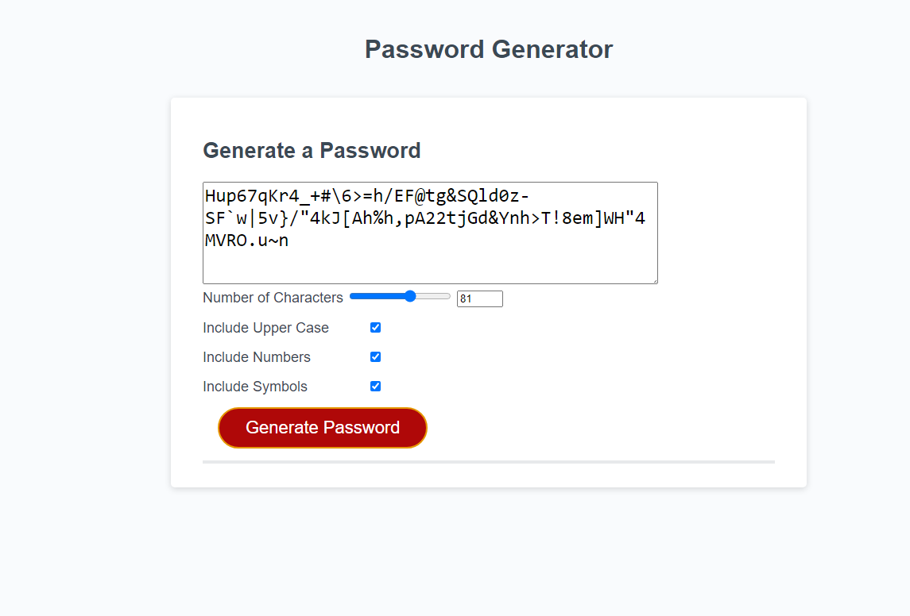

live site: https://minnesotaboy2.github.io/passwordGenerator

This site is a random password generator created for an assignment for the UofM Coding Bootcamp, you can set the passwords characters between 8 and 128, you can choose whether or not to include uppercase, numbers, or symbols as well. The only downside is you might have to drag the password window to show the entire password if you generate a longer password.

Github Repository: https://github.com/Minnesotaboy2/passwordGenerator